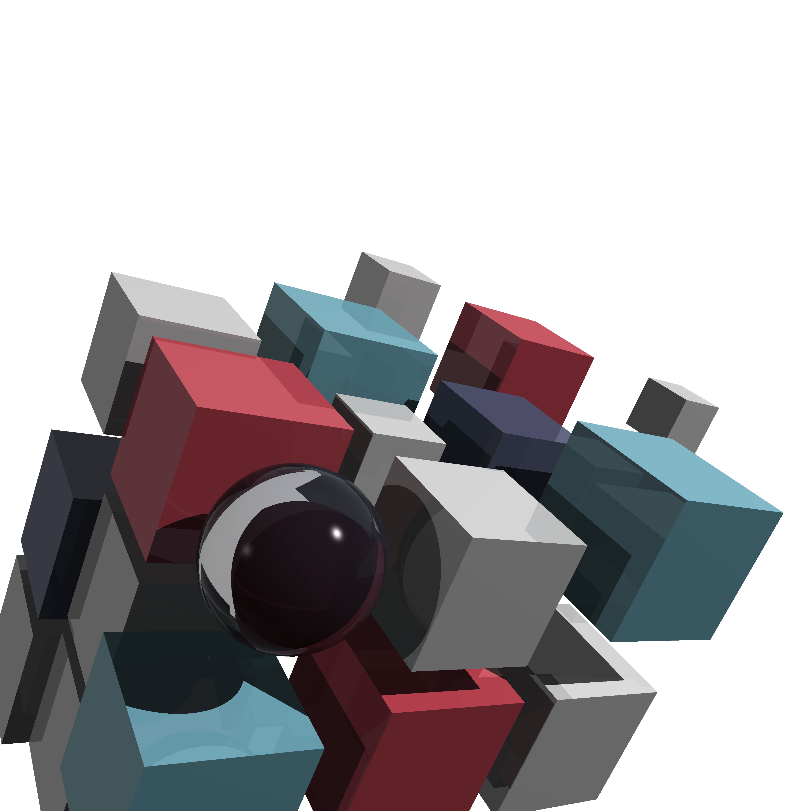
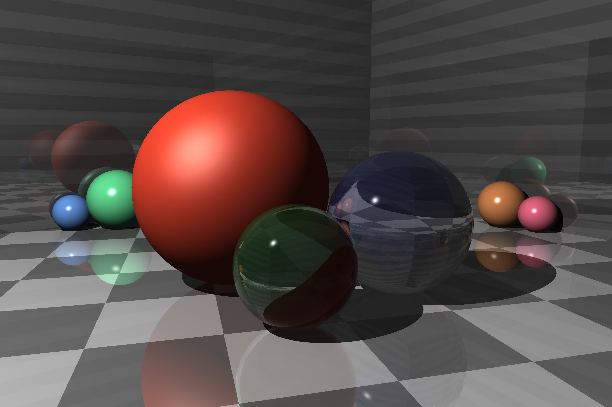
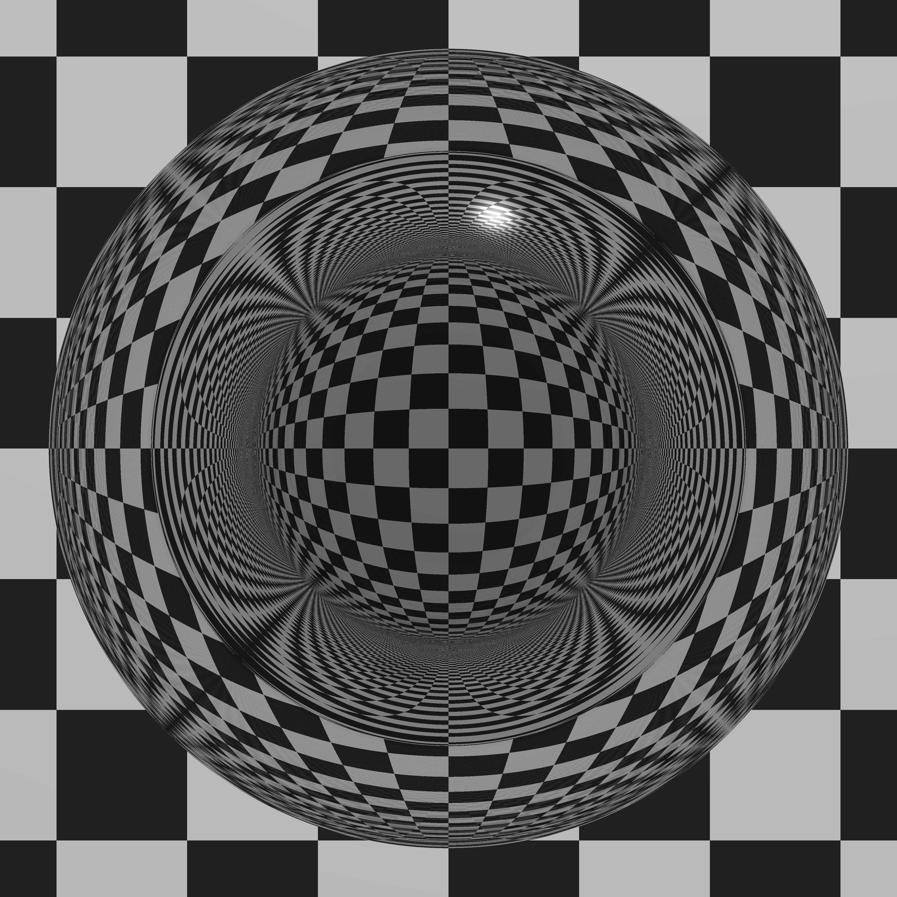
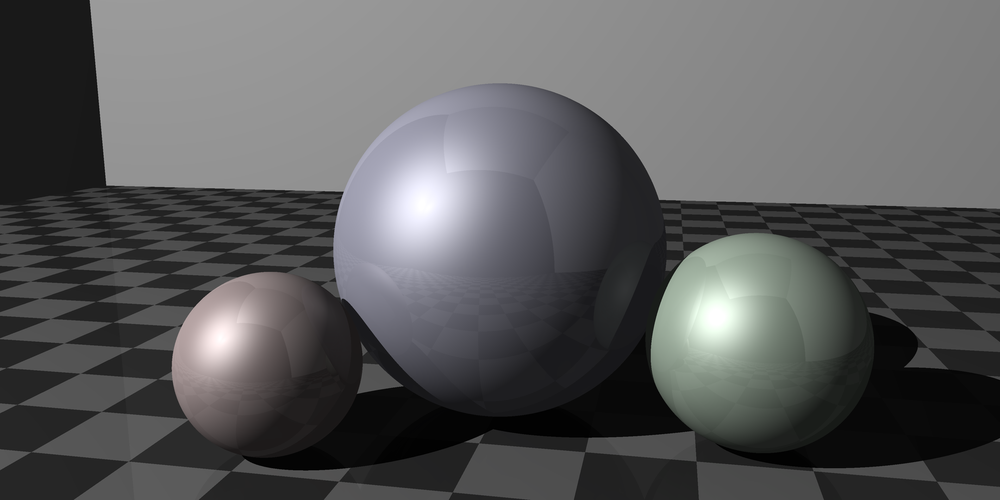
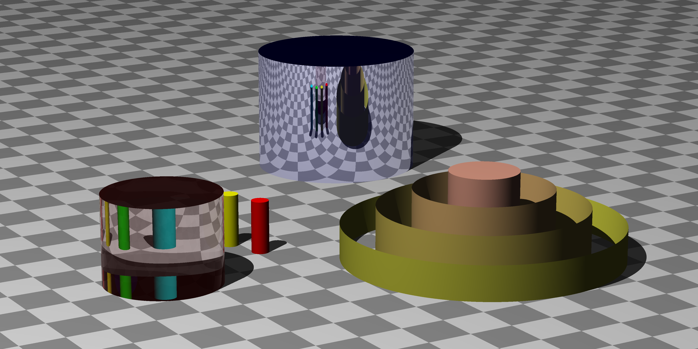
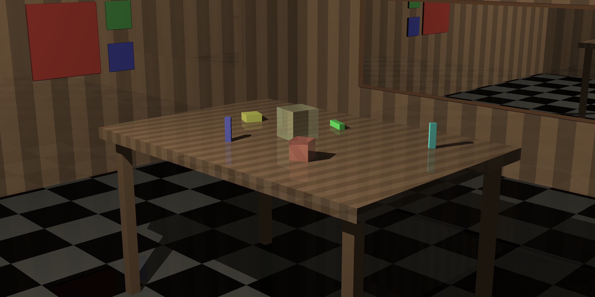
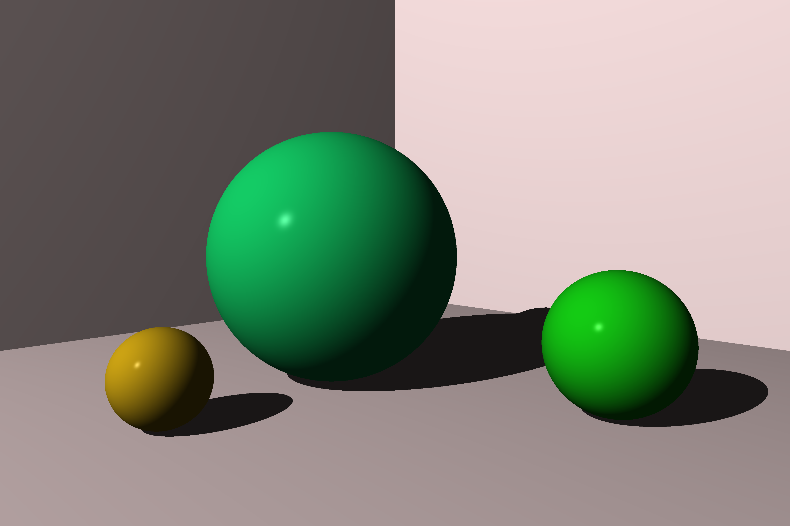
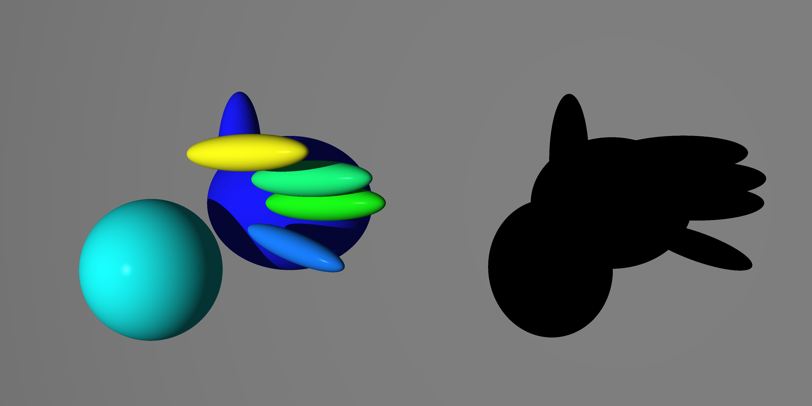

# ktracer

[](https://github.com/przemo199/k-tracer/actions/workflows/tests.yaml)

Implementation of ray tracer from Ray Tracer Challenge book by [Jamis Buck](mailto:jamis@jamisbuck.org) using Kotlin programming language.

## Features

- Handling for multiple light sources
- Groups, Constructive Solid Geometry and Bounding Boxes implemented

## Usage

```
Usage: ktracer options_list
Arguments:
    scenePath { String }
    imageOutputPath { String }
Options:
    --rendering-mode, -r [PARALLEL] { Value should be one of [serial, parallel] }
    --help, -h -> Usage info
```

## Examples
















